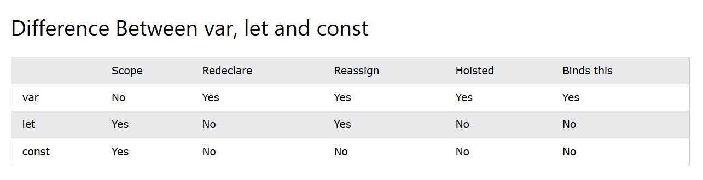

# JavaScript Tutorial

This tutorial covers essential JavaScript concepts to help you get started or enhance your understanding.

---

## Index

1. [Variables](#1-variables)
2. [Operators](#2-operators)
3. [Data Types](#3-data-types)
4. [Functions](#4-functions)
5. [Loops](#5-loops)
6. [Objects](#6-objects)
7. [Error Handling](#7-error-handling)

---

## 1. Variables

In a programming language, variables are used to store data values.
JavaScript uses the keywords var, let and const to declare variables.
An equal sign is used to assign values to variables.


-Example using  **let**:

```Let
let a=4;
let b=5;
console.log(a**b); //4^5
```

-Example using **const**:

```Const
const x = 5;
const y = 6;
const z = x + y;
```


Value = undefined
In computer programs, variables are often declared without a value. The value can be something that has to be calculated, or something that will be provided later, like user input.

A variable declared without a value will have the value undefined.

The variable carName will have the value undefined after the execution of this statement:


```Let
Example
let carName;
```


Variables defined with let cannot be redeclared.
You cannot accidentally redeclare a variable.


With let you can not do this:

```Let
let x = "John Doe";
let x = 0;
```

But with var you can do this.

Variables defined with const cannot be Redeclared.
Variables defined with const cannot be Reassigned.
Variables defined with const have Block Scope.
As a general rule, always declare a variable with const unless you know that the value will change.





```

---

## 2. Operators

JavaScript supports various operators:

- **Arithmetic Operators**: `+`, `-`, `*`, `/`, `%`, `++`, `--`
- **Assignment Operators**: `=`, `+=`, `-=`, `*=`, `/=`, `%=`
- **Comparison Operators**: `==`, `===`, `!=`, `!==`, `>`, `<`, `>=`, `<=`
- **String Operators**: `+` (concatenation)
- **Logical Operators**: `&&`, `||`, `!`
- **Bitwise Operators**: `&`, `|`, `^`, `~`, `<<`, `>>`, `>>>`
- **Ternary Operator**: `condition ? expr1 : expr2`
- **Type Operators**: `typeof`, `instanceof`
- **Spread Operator**: `...` (used to expand arrays, objects, etc.)

```javascript
let result = (5 > 3) ? "True" : "False"; // Ternary example
```

---

## 3. Data Types

JavaScript has several data types:

- **String**: Represents text, e.g., `"Hello"`
- **Number**: Represents numbers, e.g., `42`
- **BigInt**: Used for large integers, e.g., `123n`
- **Boolean**: Represents true or false values, e.g., `true`, `false`
- **Undefined**: Represents a variable that has been declared but not yet assigned a value
- **Null**: Represents an empty or non-existent value
- **Symbol**: Used for creating unique identifiers
- **Object**: Used to store collections of data

```javascript
let name = "John"; // String
let age = 30;      // Number
let isActive = true; // Boolean
```

---

## 4. Functions

Functions allow you to define reusable code:

- **Normal Function**: Defined using the `function` keyword.
- **Arrow Function**: A shorter syntax using `=>`.
- **Bind Function**: Allows setting `this` keyword explicitly.

```javascript
function add(a, b) {
  return a + b;
}

const subtract = (a, b) => a - b;

let obj = {x: 5};
function getX() { return this.x; }
let boundGetX = getX.bind(obj);
```

---

## 5. Loops

Loops help repeat a block of code:

- **for loop**
- **while loop**
- **do...while loop**

```javascript
for (let i = 0; i < 5; i++) {
  console.log(i);
}
```

---

## 6. Objects

Objects are collections of key-value pairs.

- **Creating an Object**: `new` keyword or object literal.
- **this keyword**: Refers to the object in which the function is executed.

```javascript
let person = {
  name: "John",
  age: 30,
  greet: function() {
    console.log("Hello, " + this.name);
  }
};
```

---

## 7. Error Handling

Use `try...catch` blocks to handle errors gracefully.

```javascript
try {
  // Code that may throw an error
  let result = riskyOperation();
} catch (error) {
  console.log("An error occurred:", error.message);
} finally {
  console.log("Execution completed");
}
```

---

This is a brief overview of essential JavaScript concepts. You can further explore each section for in-depth understanding.
