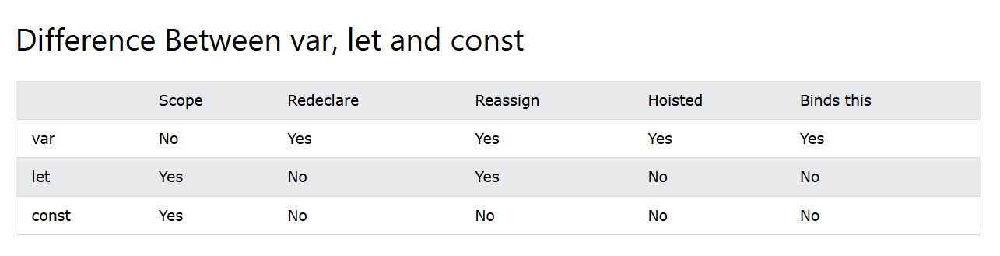

# JavaScript Tutorial

This tutorial covers essential JavaScript concepts to help you get started or enhance your understanding.

---

## Index

1. [Variables](#1-variables)
2. [Operators](#2-operators)
3. [Data Types](#3-data-types)
4. [Functions](#4-functions)
5. [Loops](#5-loops)
6. [Objects](#6-objects)
7. [Error Handling](#7-error-handling)

---

## 1. Variables

In a programming language, variables are used to store data values.
JavaScript uses the keywords var, let and const to declare variables.
An equal sign is used to assign values to variables.


-Example using  **let**:

```Let
let a=4;
let b=5;
console.log(a**b); //4^5
```

-Example using **const**:

```Const
const x = 5;
const y = 6;
const z = x + y;
```


Value = undefined


In computer programs, variables are often declared without a value. The value can be something that has to be calculated, or something that will be provided later, like user input.

A variable declared without a value will have the value undefined.

The variable carName will have the value undefined after the execution of this statement:


```Let
Example
let carName;
```


Variables defined with let cannot be redeclared.
You cannot accidentally redeclare a variable.


With let you can not do this:

```Let
let x = "John Doe";
let x = 0;
```

But with var you can do this.

Variables defined with const cannot be Redeclared.
Variables defined with const cannot be Reassigned.
Variables defined with const have Block Scope.
As a general rule, always declare a variable with const unless you know that the value will change.





## 2. Operators


JavaScript uses arithmetic operators ( + - * / ) to compute values:

```arithmatic
Example
let x = 5;
let y = 2;
let z = x % y;
Output:1
```


Arithmetic operators are used to perform arithmetic on numbers:


Operator precedence describes the order in which operations are performed in an arithmetic expression.


```
Example
let x = 100 + 50 * 3;
output:250
```

- **Assignment Operators**:

- JavaScript uses an assignment operator ( = ) to assign values to variables:

  


Assignment operators assign values to JavaScript variables.


```
Example
let text = "Hello"; text += " World";
output:Hello World
```

Simple Assignment and Chaining:


```
let x = 5;
let y = 10;
let z = 25;

x = y; // x is 10
x = y = z; // x, y and z are all 25
```


The assignment expression itself evaluates to the value of the right-hand side, so you can log the value and assign to a variable at the same time.


```
let x;
console.log(x); // undefined
console.log(x = 2); // 2
console.log(x); // 2
```


JavaScript Comparison Operators!


In JavaScript, == and === are two different comparison operators used to compare values.
== (Equality Operator):
This operator checks for equality after performing type coercion. It converts the operands to the same type before making the comparison.
For example, 5 == "5" would be true because the string "5" is coerced to the number 5 during the comparison.
=== (Strict Equality Operator):
This operator checks for equality without performing type coercion. It compares both the value and the type of the operands.
For example, 5 === "5" would be false because the value 5 is of type number, and the string "5" is of type string.
In general, it is recommended to use === (strict equality) to avoid unexpected results due to type coercion. Using === ensures that both the value and the type are the same for the comparison to be true.


JavaScript Logical Operators:


Logical AND:

```
const a = 3;
const b = -2;

console.log(a > 0 && b > 0);
// Expected output: false
```

 Logical NOT:
```
const a = 3;
const b = -2;

console.log(!(a > 0 || b > 0));
// Expected output: false
```


JavaScript Bitwise Operators:


In JavaScript, the >> and >>> are bitwise right shift operators.
>> (Signed Right Shift):
The >> operator shifts the bits of a number to the right. It preserves the sign bit, which means that if the number is positive, it pads the left side with zeros, and if the number is negative, it pads the left side with ones.
Example: x >> y shifts the bits of x to the right by y positions.
>>> (Unsigned Right Shift):
The >>> operator also shifts the bits to the right, but it always pads the left side with zeros, regardless of the sign of the number. It treats the number as if it were an unsigned integer.
Example: x >>> y shifts the bits of x to the right by y positions, and the left side is always padded with zeros.
Here's a quick example to illustrate the difference:


```
let x = -8;

console.log(x >> 2);   // Output: -2 (Signed right shift)
console.log(x >>> 2);  // Output: 1073741822 (Unsigned right shift)
```


In the example, x >> 2 performs a signed right shift, while x >>> 2 performs an unsigned right shift.


JavaScript Demo: Expressions - Bitwise AND


```
const a = 5; // 00000000000000000000000000000101
const b = 3; // 00000000000000000000000000000011

console.log(a & b); // 00000000000000000000000000000001
// Expected output: 1
```


Bitwise AND assignment:


```
let a = 5; // 00000000000000000000000000000101
a &= 3; // 00000000000000000000000000000011

console.log(a); // 00000000000000000000000000000001
// Expected output: 1
```
x &= y


x &= y is equivalent to x = x & y, except that the expression x is only evaluated once.

```
let a = 5;
// 5:     00000000000000000000000000000101
// 2:     00000000000000000000000000000010
a &= 2; // 0
```

Bitwise NOT:


```
const a = 5; // 00000000000000000000000000000101
const b = -3; // 11111111111111111111111111111101

console.log(~a); // 11111111111111111111111111111010
// Expected output: -6

console.log(~b); // 00000000000000000000000000000010
// Expected output: 2
```
Bitwise XOR:


The bitwise XOR (^) operator returns a number or BigInt whose binary representation has a 1 in each bit position for which the corresponding bits of either but not both operands are 1.

```
const a = 5; // 00000000000000000000000000000101
const b = 3; // 00000000000000000000000000000011

console.log(a ^ b); // 00000000000000000000000000000110
// Expected output: 6
```

Conditional (ternary) operator:


The conditional (ternary) operator is the only JavaScript operator that takes three operands: a condition followed by a question mark (?), then an expression to execute if the condition is truthy followed by a colon (:), and finally the expression to execute if the condition is falsy. This operator is frequently used as an alternative to an if...else statement

```
let age=18;
let result= age>18?"adult":"notAdult";
console.log(result)
output:notAdult
```
JavaScript String Operators:


JavaScript String Operators are used to manipulate and perform operations on strings. There are two operators which are used to modify strings in JavaScript. These operators help us to join one string to another string.


Type of JavaScript String Operators


1. Concatenation (+ Operator)


The + operator is used to join two or more strings together.

```
let greeting = "Hello, " + "world!"; // Output: "Hello, world!"
```

2. Concatenation Assignment (+= Operator)

   
The += operator appends one string to another and assigns the result to the original variable.
```
let message = "Hello";
message += ", world!"; // message becomes "Hello, world!"
```


The typeof Operator:


The typeof operator returns the data type of a JavaScript variable.


JavaScript has 7 primitive data types:


-string

-number

-boolean

-bigint

-symbol

-null

-undefined

---

## 2. Operators


JavaScript uses arithmetic operators ( + - * / ) to compute values:


JavaScript supports various operators:

- **Arithmetic Operators**: `+`, `-`, `*`, `/`, `%`, `++`, `--`
- **Assignment Operators**: `=`, `+=`, `-=`, `*=`, `/=`, `%=`
- **Comparison Operators**: `==`, `===`, `!=`, `!==`, `>`, `<`, `>=`, `<=`
- **String Operators**: `+` (concatenation)
- **Logical Operators**: `&&`, `||`, `!`
- **Bitwise Operators**: `&`, `|`, `^`, `~`, `<<`, `>>`, `>>>`
- **Ternary Operator**: `condition ? expr1 : expr2`
- **Type Operators**: `typeof`, `instanceof`
- **Spread Operator**: `...` (used to expand arrays, objects, etc.)

```javascript
let result = (5 > 3) ? "True" : "False"; // Ternary example
```

---

## 3. Data Types

JavaScript has several data types:

- **String**: Represents text, e.g., `"Hello"`
- **Number**: Represents numbers, e.g., `42`
- **BigInt**: Used for large integers, e.g., `123n`
- **Boolean**: Represents true or false values, e.g., `true`, `false`
- **Undefined**: Represents a variable that has been declared but not yet assigned a value
- **Null**: Represents an empty or non-existent value
- **Symbol**: Used for creating unique identifiers
- **Object**: Used to store collections of data

```javascript
let name = "John"; // String
let age = 30;      // Number
let isActive = true; // Boolean
```

---

## 4. Functions

Functions allow you to define reusable code:

- **Normal Function**: Defined using the `function` keyword.
- **Arrow Function**: A shorter syntax using `=>`.
- **Bind Function**: Allows setting `this` keyword explicitly.

```javascript
function add(a, b) {
  return a + b;
}

const subtract = (a, b) => a - b;

let obj = {x: 5};
function getX() { return this.x; }
let boundGetX = getX.bind(obj);
```

---

## 5. Loops

Loops help repeat a block of code:

- **for loop**
- **while loop**
- **do...while loop**

```javascript
for (let i = 0; i < 5; i++) {
  console.log(i);
}
```

---

## 6. Objects

Objects are collections of key-value pairs.

- **Creating an Object**: `new` keyword or object literal.
- **this keyword**: Refers to the object in which the function is executed.

```javascript
let person = {
  name: "John",
  age: 30,
  greet: function() {
    console.log("Hello, " + this.name);
  }
};
```

---

## 7. Error Handling

Use `try...catch` blocks to handle errors gracefully.

```javascript
try {
  // Code that may throw an error
  let result = riskyOperation();
} catch (error) {
  console.log("An error occurred:", error.message);
} finally {
  console.log("Execution completed");
}
```

---

This is a brief overview of essential JavaScript concepts. You can further explore each section for in-depth understanding.
